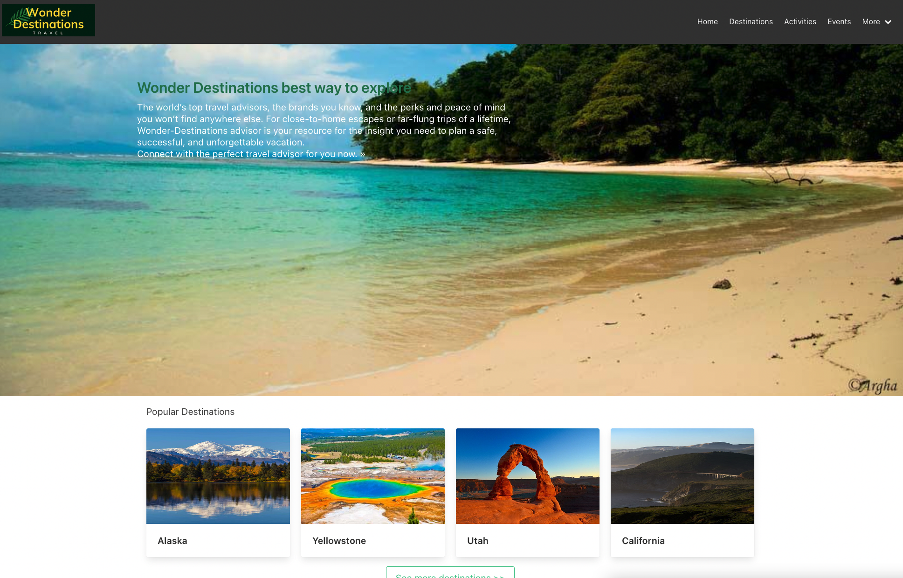
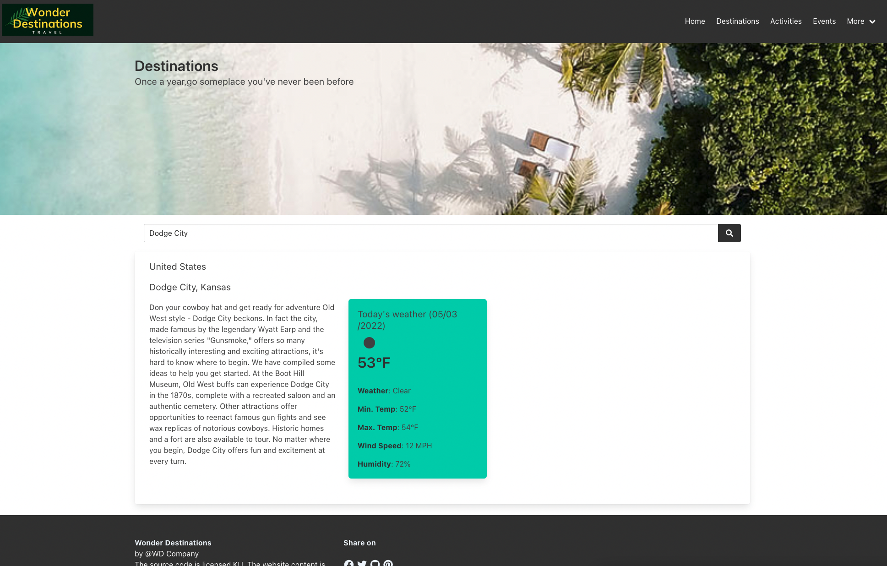
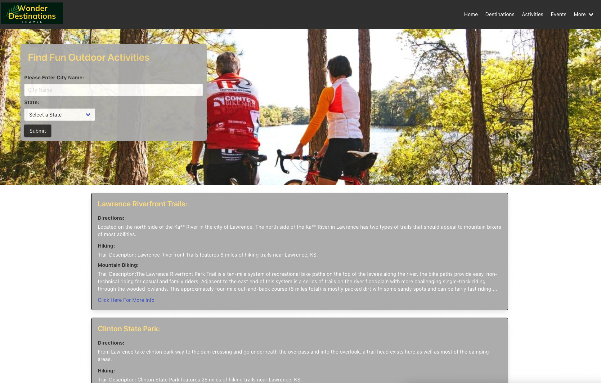
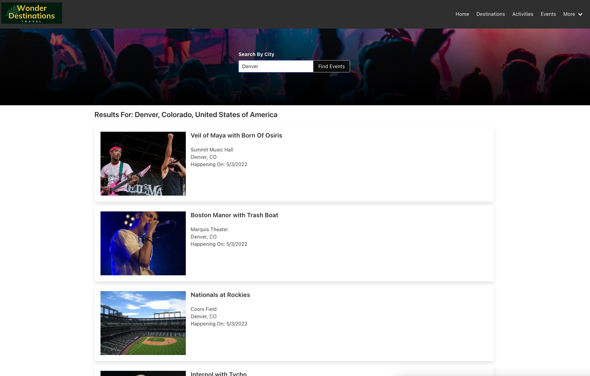

# Wonder Destinations

**Wonder Destinations** is a travel guide for tourists looking to travel to exciting new places. Find hiking trails or get tickets for events happening nearby!

[View Live Site](https://carlosrrdev.github.io/wonder-destinations/)

## Site Preview

## User Story

> AS a tourist
>
> I WANT to see suggestions locations for travel, hiking trails, and local events
>
> SO THAT I can have a great experience when I travel

## Acceptance Criteria

- WHEN I visit the Home page
- THEN I am presented with a navigation bar to the other pages
- WHEN I visit the Home page
- THEN I am presented with sample destination cards with images
- WHEN I visit the Activities page
- THEN I am presented with a form where I can input a destination
- THEN I am presented with activities close to my selected destination
- WHEN I visit the Events page
- THEN I am presented with a form where I can input a destination or search locally
- THEN I am presented with events happening in my selected destination

## Technology Stack

- HTML
- CSS (BulmaCSS)
- Javascript (JQuery)
